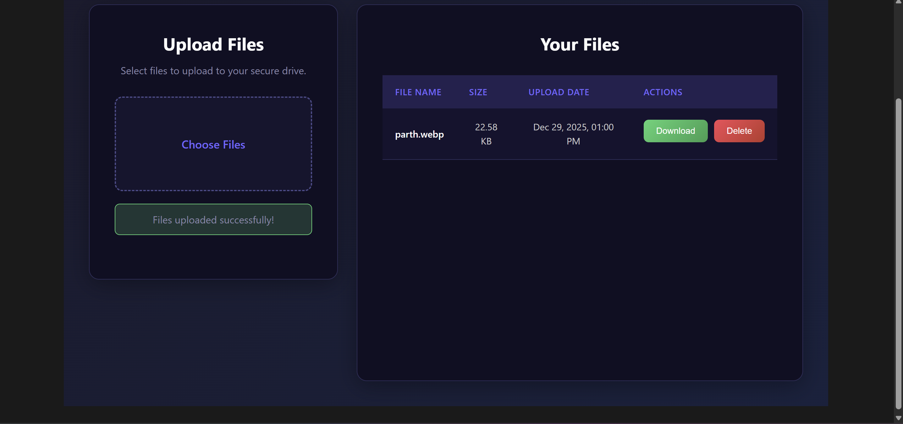

# VinnoDrive

A simple file storage application that allows users to upload, view, download, and delete files.



## Features

- 📤 **File Upload** - Upload multiple files at once
- 📋 **File Listing** - View all uploaded files with name, size, and upload date
- 📥 **File Download** - Download files directly to your device
- 🗑️ **File Delete** - Remove files from storage
- 🎨 **Modern UI** - Dark-themed, responsive flexbox design

## Tech Stack

### Frontend

- **React** - UI library
- **Vite** - Build tool and dev server
- **CSS3** - Styling with flexbox layout

### Backend

- **Node.js** - Runtime environment
- **Express.js** - Web framework
- **MongoDB Atlas** - Cloud database
- **Mongoose** - MongoDB ODM
- **Multer** - File upload handling

### Other

- **express-rate-limit** - API rate limiting
- **dotenv** - Environment variable management
- **cors** - Cross-origin resource sharing

## Prerequisites

- Node.js (v16 or higher)
- npm (v8 or higher)
- MongoDB Atlas account

## Installation

1. **Clone the repository**

   ```bash
   git clone https://github.com/yourusername/vinnodrive.git
   cd vinnodrive
   ```

2. **Install dependencies**

   ```bash
   npm install
   ```

3. **Create environment file**

   Create a `.env` file in the root directory:

   ```env
   MONGODB_URI=your_mongodb_connection_string
   PORT=5000
   ```

## Running the Application

Run both servers in separate terminals:

### Terminal 1 - Backend

```bash
npm run server
```

Runs on `http://localhost:5000`

### Terminal 2 - Frontend

```bash
npm run dev
```

Runs on `http://localhost:5173`

## API Endpoints

| Method   | Endpoint        | Description            |
| -------- | --------------- | ---------------------- |
| `POST`   | `/upload`       | Upload a file          |
| `GET`    | `/files`        | Get all uploaded files |
| `GET`    | `/download/:id` | Download a file by ID  |
| `DELETE` | `/delete/:id`   | Delete a file by ID    |

## Project Structure

```
vinnodrive/
├── src/
│   ├── frontend/
│   │   ├── basic_Components.jsx
│   │   └── basic_Components.css
│   └── main.jsx
├── uploads/
├── server.js
├── vite.config.js
├── package.json
├── .env
└── README.md
```

## License

MIT License
